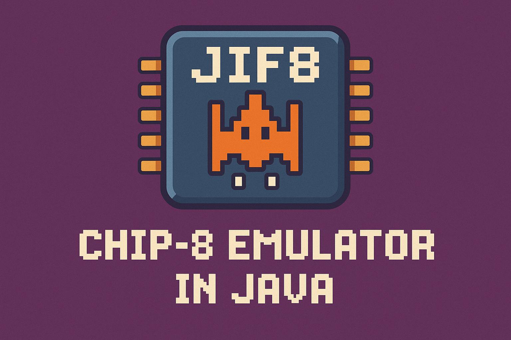

<center>


</center>

---

## What's JIF-8?
JIF-8 (derived from "`J`ava" and "Ch`ip-8`") is a modern implementation of a Chip-8 emulator written in Java using JavaFX for the graphical user interface. It's developed as the final project by our cool team for the Object-Oriented Programming course at Faculty of Engineering, Zagazig University.

[Chip-8](https://en.wikipedia.org/wiki/CHIP-8) is an interpreted programming language developed by [Joseph Weisbecker](https://en.wikipedia.org/wiki/Joseph_Weisbecker) in the mid-1970s. It was initially designed to allow video games to be more easily programmed for 8-bit microcomputers. The CHIP-8 machine language runs programs written in 4KB of memory and displays graphics on a 64x32 pixel monochrome display. Despite its simplicity, many classic games were developed for this platform, making it an excellent introduction to emulator development.

## How to Run

This project is a Chip-8 emulator written in Java. Follow the steps below to build and run the application using Maven:

### Prerequisites
1. Ensure you have [Java JDK](https://www.oracle.com/java/technologies/javase-downloads.html) (version 8 or higher) installed.
2. Install [Apache Maven](https://maven.apache.org/install.html).

### Steps to Build and Run
1. Clone the repository:
    ```bash
    git clone https://github.com/hulxv/jif-8.git
    cd jif-8
    ```

2. run the project using Maven:
    ```bash
    mvn clean javafx:run
    ```

## License
JIF-8 is licensed under the GNU General Public License v2.0. This means you can freely use, modify, and distribute this software according to the terms specified in the GPL-2.0 license.

For more details, see the [LICENSE](LICENSE) file in the repository.