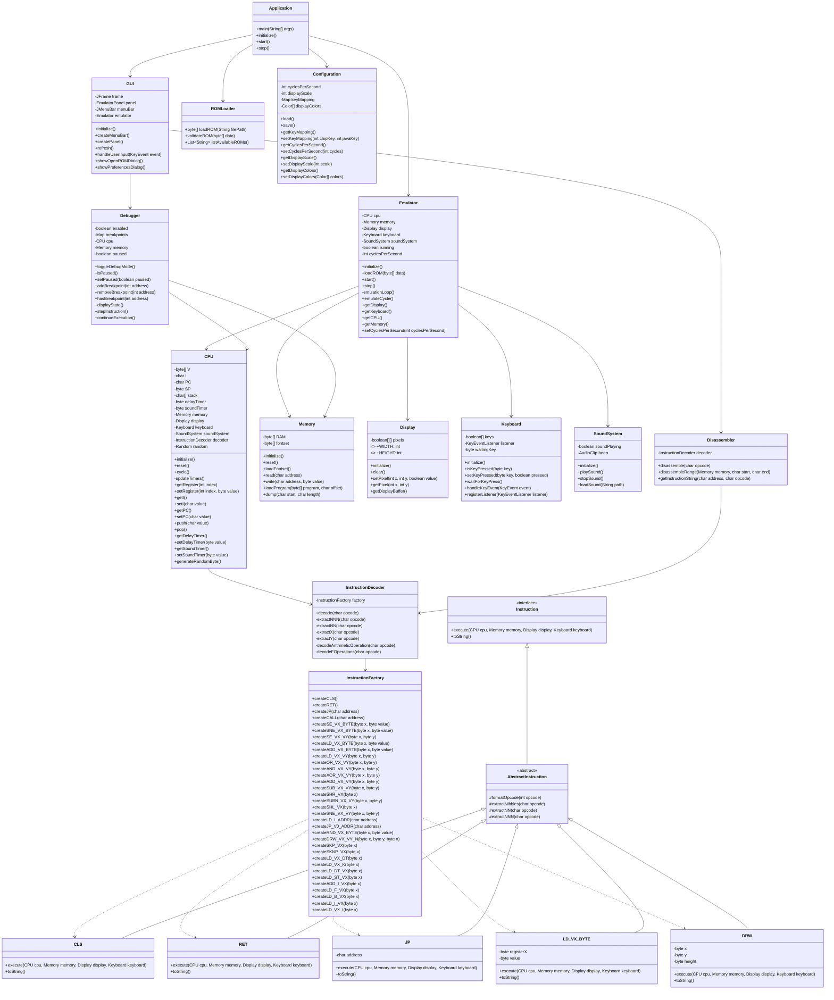

# JIF-8 Architecture

## Project Overview

The goal is to develop a fully functional CHIP-8 emulator in Java that accurately simulates the original CHIP-8 interpreter from the 1970s. CHIP-8 is an ideal first emulation project due to its simplicity while still offering a complete virtual machine experience.

## System Architecture

## Project Tasks Breakdown

### Phase 1: Core Emulator Components 

1. **Memory Subsystem** 
   - Implement 4KB memory space
   - Add font set loading
   - Create memory read/write methods

2. **CPU Implementation** 
   - Implement registers (V0-VF, I, PC, SP)
   - Create fetch-decode-execute cycle
   - Set up timers (delay and sound)

3. **Instruction Set Development** 
   - Create instruction decoder
   - Implement all 35 CHIP-8 opcodes
   - Develop instruction execution framework

4. **Display Component** 
   - Create 64x32 display buffer
   - Implement sprite drawing
   - Add screen clearing functionality

### Phase 2: I/O and Integration

5. **Keyboard Input**
- Map physical keys to CHIP-8 hexadecimal keypad
   - Implement key press/release detection
   - Add key-wait functionality

6. **Sound System** 
   - Implement basic tone generation
   - Connect to sound timer

7. **ROM Loading** 
   - Create file loader for CHIP-8 programs
   - Add validation for ROM format
   - Implement memory mapping of program data

### Phase 3: User Interface

8. **GUI Development** 
   - Create main application window
   - Implement display rendering with scaling
   - Add menus and file dialog for ROM selection
   - Create control panel for emulator operation

9. **Debugger Implementation** 
   - Add register and memory viewers
   - Implement breakpoint system
   - Create instruction stepping functionality
   - Add disassembly view

10. **Configuration System** 
    - Add settings for display colors
    - Create key mapping configuration
    - Implement emulation speed controls

### Phase 4: Testing and Refinement 

11. **Unit Testing** 
    - Write tests for CPU operations
    - Create test cases for instruction execution
    - Validate memory and display functions

### Phase 5: Documentation 

14. **Documentation** (3 days)
    - Create JavaDoc for all components
    - Write user guide for the emulator
    - Document the CHIP-8 specification

15. **Packaging and Deployment** (2 days)
    - Create build scripts
    - Package as executable JAR
    - Set up release platform

## Development Environment

- **Language**: Java 17+
- **Build Tool**: Maven 
- **Version Control**: Git with GitHub
