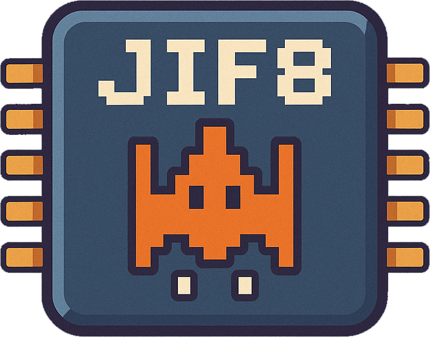

# JIF-8: A CHIP-8 Emulator

***Built with Java and JavaFX***



**Team:** The High Council

---

# What is CHIP-8?

- Created by Joseph Weisbecker in the mid-1970s
- Not a real hardware platform, but a virtual machine
- Designed to make game programming easier on 8-bit microcomputers


<p style="font-size: 15px">
Telmac 1800 running CHIP-8 game Space Intercept (Joseph Weisbecker, 1978)
</p>

---

# Historical Context

- Developed during the early days of video gaming (1970s)
- Predates popular systems like Atari 2600 (1977)
- One of the first platforms for hobbyist game development
- Ran on systems like:
  - COSMAC VIP (1977)
  - Telmac 1800 (1977)
  - ETI 660 (1981)

---


# CHIP-8 Specifications

- Memory: 4KB (4,096 bytes)
- Display: 64x32 monochrome pixels
- 16 8-bit registers (V0 to VF)
- 16-bit index register (I)
- 16-level stack
- 16-key hexadecimal keypad
- 35 instructions

---

# CPU Architecture Detail

```ascii
+---------------+     +----------------+     +---------------+
|   Registers   |     |  Instructions  |     |    Memory     |
| V0-VF,I,PC,SP |<--->|  Fetch/Decode  |<--->| RAM: 4KB      |
|               |     |    Execute     |     | Font/Program  |
+---------------+     +----------------+     +---------------+
        ^                    ^                     ^
        |                    |                     |
        v                    v                     v
+---------------+     +----------------+     +---------------+
|    Timers     |     |    Display     |     |   Keyboard    |
| Delay/Sound   |     |    64 x 32     |     |   16 Keys     |
+---------------+     +----------------+     +---------------+
```


---

# Memory Layout

```
+---------------+ = 0xFFF (4095)
|               |
|               |
|               |
|    Program    |
|               |
|               |
+---------------+ = 0x200 (512)
|  Fonts        |
+---------------+ = 0x000 (0)
```
---

# Instruction Flow

```ascii
    +--------+     +---------+     +----------+     +------------+
    | Fetch  |---->| Decode  |---->| Execute  |---->| Update     |
    |        |     |         |     |          |     | Timers     |
    +--------+     +---------+     +----------+     +------------+
         ^                                               |
         +-----------------------------------------------+
```

---


# Design Patterns Used

1. **Factory Pattern**
   - `InstructionFactory` creates different instruction objects
   - Decouples instruction creation from execution

2. **Command Pattern**
   - Each instruction is a separate class
   - Encapsulates execution logic


---

# Debugging Features

- Register state visualization
- Memory viewer
- Stack viewer
- Pause/Resume support

---

# Demo Time!

- Running ROMs
- Debugger usage
- Game demonstration

---

<h1 style="font-size: 100px">Thank you!</h1>

GitHub Repository: [github.com/hulxv/jif-8](https://github.com/hulxv/jif-8)
